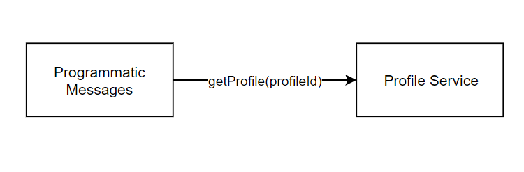
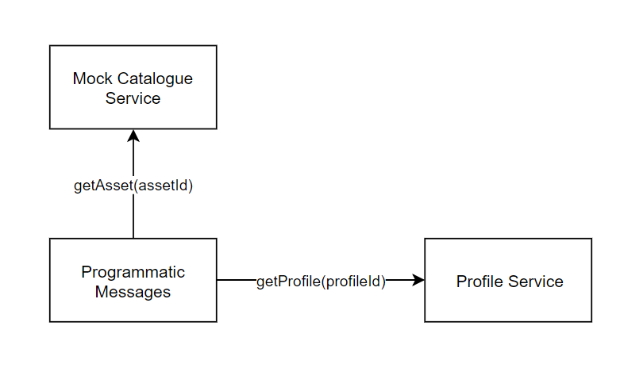
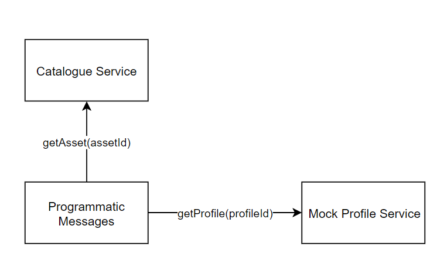
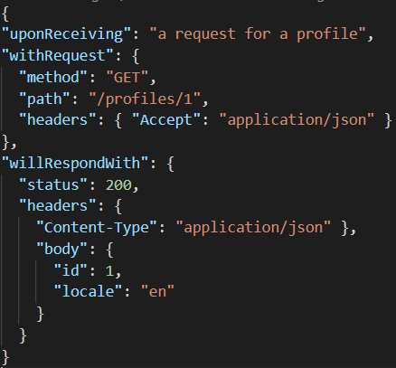
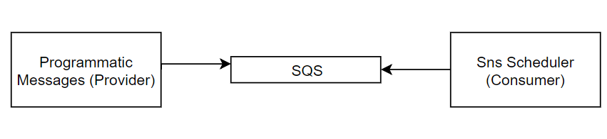

# Consumer Driven Contract Testing

---
The most depressing thing about life as a programmer, I think, is if you’re faced with a chunk of code that either someone else wrote or, worse still, you wrote yourself but no longer dare to modify. That’s depressing.

*Simon Peyton Jones*

---
## Correctness Delima
- am I calling the correct endpoint?
- did i pass the correct parameters?
- is the api returning the response that i expect?
- is it safe to delete or change a given endpoint?
- did we accidently change the response schema?
---
## Unit Tests
They are easy to write
```javascript
const add = (a, b) => a + b
describe('add', ()=> {
  it('should add two numbers', ()=> {
    expect(add(!,2)).toEqual(3)
  })
})
```
+++
## Unit Tests
We can write many of them
```javascript
const nextContinueWatchingAssetItem = () => {/*.*/}

it('should skip shorts')
it('should return a movie when its progress is less than 80%')
it(`should skip show if there are less than 5 minutes remaining,
 and there is no next episode`)
```
+++
## Unit Tests
Can test happy and sad paths
```javascript

const becauseYouWatchedService = ()=>{/*..*/}
it('should send a notification when there is an item to recommend')
it('should not send any notification when it fails to fetch foggles')
```
+++
## Unit Tests
Aren't suitable for all cases as you can't test outside the boundries of the service
```javascript
const getUser = (conn,userId) => conn.queryOne(
  `SELECT * from users where id = $1`,
  [userId])
```
---
## Integration Tests
They can cross the boundries of a single service and test interactions with other services.

+++
## Integration Tests
Reality is more complicated

+++
## Integration Tests
Reality is more complicated

+++
## Integration Tests
 - can detect if services are broken and can't talk to each other
 - slow and expensive to write
 - Could be flaky
---
## E2E
 - slow
 - slow
 - slow
 - flaky++
---
## Consumer Contract Driven Testing
- Provider: an Application responsible for publishing an API
- Consumer: an Application who needs to call that api
+++
@title[Interaction]
@snap[west span-30]

@snapend
@snap[east span-70]

@snapend

+++
## Consumer Tests

+++
## Pacts (Contracts)

+++
## Provider Tests

+++
## Consumer driven contract testing
- It's two steps verification
- It fails if changes in the provider cause it to be unable to return the expected response in the contract
- It fails if the consumer is using invalid endpoints, or missing required parameters we would know
+++
## Async Messages
- Consumer: Reads messages from messages broker
- Provider: Send messages to messages broker
